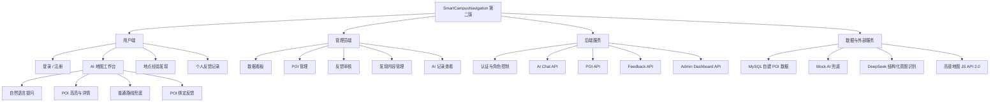
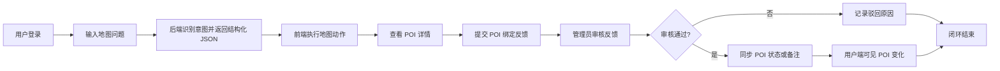
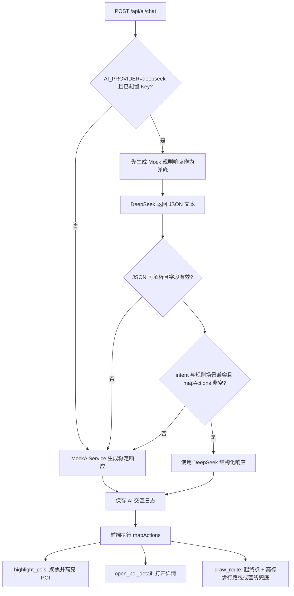
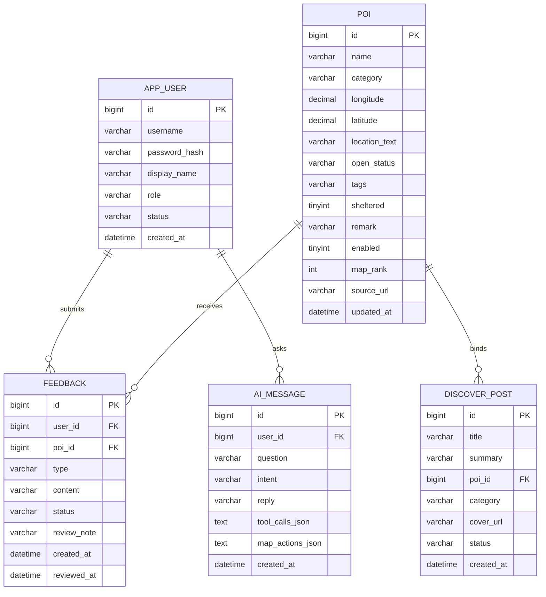

# SmartCampusNavigation 第二版论文材料

本文件提供可直接整理进论文的结构图、流程图、ER 图和测试用例表。图中名称以第二版实际实现为准：AI 地图交互、NUIST POI 数据、高德地图兜底、反馈修正闭环。

## 系统功能结构图

## 业务流程图

## AI 地图动作流程图

## ER 图

## 测试用例表

| 编号 | 模块 | 测试场景 | 输入或操作 | 预期结果 |
| --- | --- | --- | --- | --- |
| TC-01 | AI 地图 | 中文条件推荐 | `找一个安静有插座的自习点` | 返回 `recommend_place`，地图高亮自习类 POI |
| TC-02 | AI 地图 | 英文条件推荐 | `Find a quiet study place with outlets` | 返回英文回复，结构化地图动作正常执行 |
| TC-03 | AI 地图 | 精确地点查找 | `Find Campus Print Shop` | 返回 `find_poi`，结果聚焦打印相关 POI |
| TC-04 | AI 地图 | 路线帮助 | `Go from Xiyuan Dormitory Area to NUIST Library Study Area` | 返回 `draw_route`，显示起点、终点和普通路线兜底 |
| TC-05 | AI 容错 | 未配置 DeepSeek Key | 不设置 `DEEPSEEK_API_KEY` | 自动使用 Mock AI，页面不报错 |
| TC-06 | AI 容错 | DeepSeek 非 JSON | 模拟返回非 JSON 文本 | 回退 Mock AI |
| TC-07 | AI 容错 | DeepSeek 缺少 `mapActions` | 模拟响应只有 `poiIds` | 回退 Mock AI |
| TC-08 | AI 容错 | DeepSeek 返回非法 POI ID | 模拟 `poiIds=[999]` | 丢弃非法动作并回退 Mock AI |
| TC-09 | 地图容错 | 未配置高德 Key | 清空 `VITE_AMAP_KEY` | 显示模拟地图和兜底提示 |
| TC-10 | 地图容错 | 高德加载失败 | 阻断高德脚本加载 | 页面不崩溃，继续显示模拟地图 |
| TC-11 | 反馈闭环 | 提交 POI 反馈 | 从 POI 详情填写反馈 | 反馈绑定当前 POI 并进入待审核 |
| TC-12 | 反馈闭环 | 游离反馈提交 | 请求体缺少 `poiId` | 后端拒绝提交 |
| TC-13 | 反馈闭环 | 反馈绑定不存在 POI | 请求体 `poiId=404` | 后端拒绝提交，不写入反馈表 |
| TC-14 | 管理端 | 审核通过并同步备注 | 管理员通过反馈并填写 POI 备注 | 用户端 POI 详情显示新备注 |
| TC-15 | UI | 1024/1440 宽度检查 | 切换中英文查看核心页面 | 按钮、表格、快捷问题文本不溢出 |

## 数据来源说明

POI 数据采用自建表维护，高德地图仅作为底图、Marker、坐标预览和普通路线兜底。第二版种子数据包含 100 条启用 POI，其中 `map_rank` 为 1-20 的地点作为默认地图热门层。地点覆盖参考以下官方页面，具体坐标和演示标签为系统演示数据：

- [NUIST 校园地图服务](https://nic.nuist.edu.cn/2473/listm.htm)
- [Campus and Facilities](https://en.nuist.edu.cn/4204/list.psp)
- [Library](https://en.nuist.edu.cn/4061/list.psp)
- [Sports](https://en.nuist.edu.cn/4062/list.psp)
- [Medical Service](https://en.nuist.edu.cn/_s104/4217/list.psp)
- [Services](https://en.nuist.edu.cn/4071/listm.psp)
